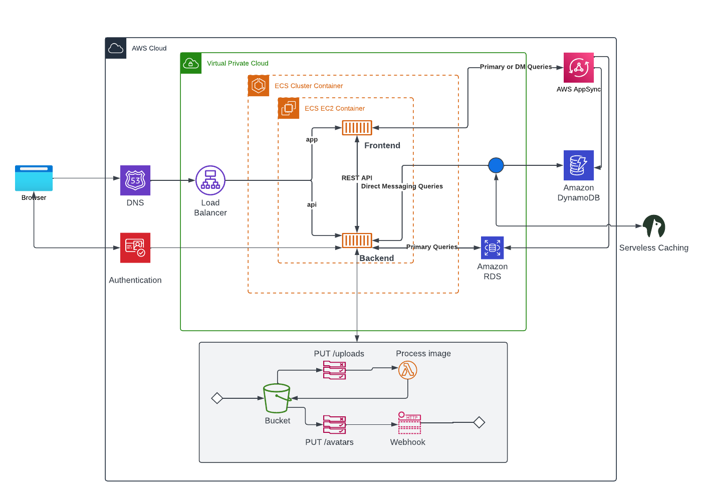
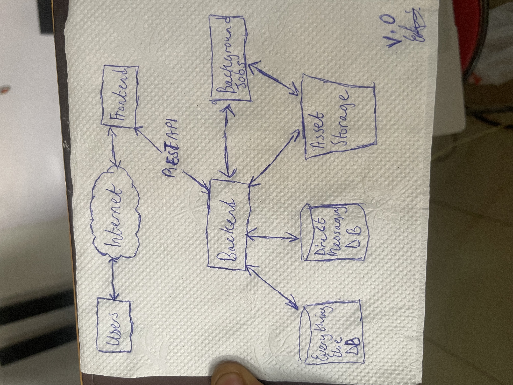

# Week 0 — Billing and Architecture

In this week,
 - I was able to setup my AWS account
    - Setup MFA for the root and IAM user
    - Setup Budget
    - Generated AWS Credentials
    - Installed AWS CLI

- I created the logical Architectural diagram for the project with lucid
    - [This is the link to the Logigical Architectural diagram](https://lucid.app/lucidchart/c502c256-4737-41a7-ae7b-be0ec213f0e8/edit?view_items=uzrx3ktFj_rm&invitationId=inv_d2238f28-118a-4894-a6d7-2e81b30fbeaf)
    - 
- I created the Conceptual Diagram using a napkin
    - 
